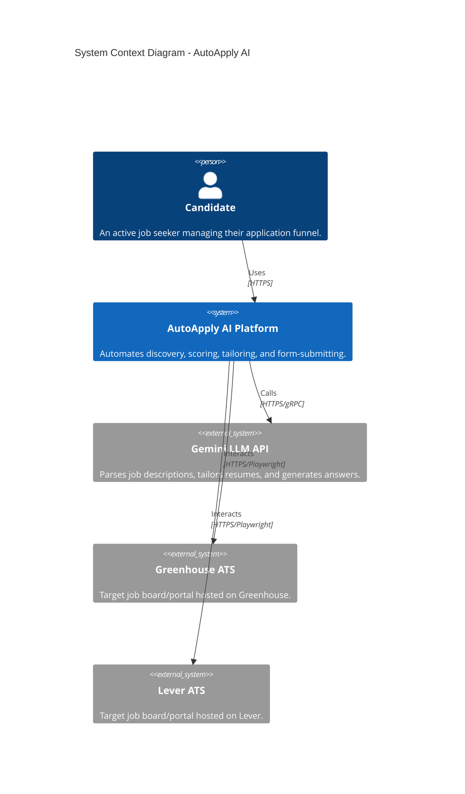
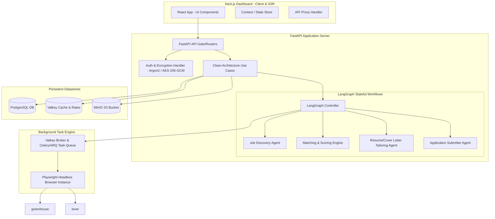
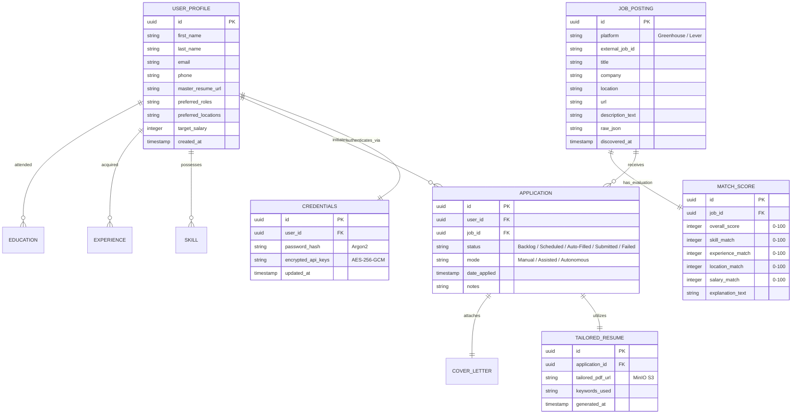

# Architecture Diagrams - AutoApply AI

**Source**: `docs/architecture/design/00-system-architecture-greenfield.md`  
**Generated**: 2026-06-19

> This file contains Mermaid diagrams extracted from the architecture document for easy preview and verification by the QA and Technical teams.

---

## Clean Architecture Layering

```mermaid
┌───────────────────────────────────────────────────────────────┐
│                    INFRASTRUCTURE LAYER                       │
│  (Next.js Web UI, FastAPI Routers, Playwright, DB Migrations) │
│  ┌─────────────────────────────────────────────────────────┐  │
│  │                  APPLICATION LAYER                       │  │
│  │    (LangGraph Agents, Connectors, Use Cases, Services)   │  │
│  │  ┌─────────────────────────────────────────────────────┐│  │
│  │  │                  DOMAIN LAYER                        ││  │
│  │  │       (User Entities, Profiles, Match Scores, IRs)  ││  │
│  │  └─────────────────────────────────────────────────────┘│  │
│  └─────────────────────────────────────────────────────────┘  │
└───────────────────────────────────────────────────────────────┘
                            ↑
              Dependencies point INWARD only
```

---

## System Context Diagram



---

## Component Architecture Diagram



---

## Data Model / ER Diagram


