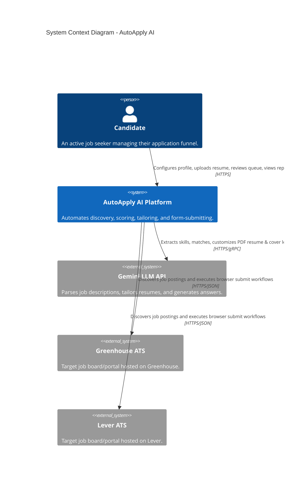
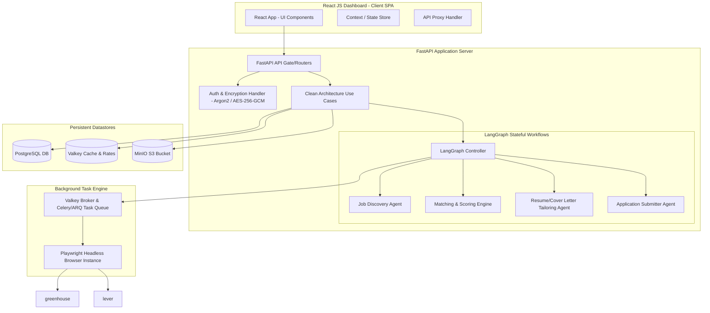
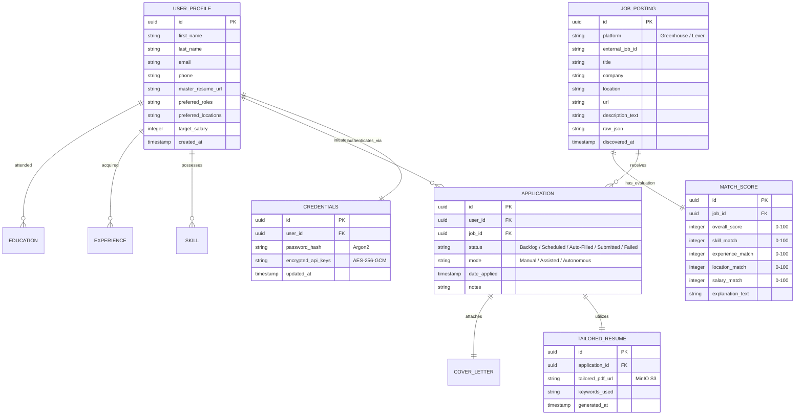

# System Architecture - AutoApply AI

**Date**: 2026-06-19  
**Author**: ARCHITECT  
**Status**: Approved  
**Version**: 1.0

---

## Overview

### Purpose
AutoApply AI is a modern, self-hosted, privacy-first job application automation system. It utilizes high-fidelity multi-agent orchestration via **LangGraph**, **Gemini LLM**, and headless browser automation to automatically discover, score, customize, and submit job applications to various ATS platforms (Greenhouse and Lever in v0.1).

### Architecture Style
The system is built on **Clean Architecture** principles, separating the core domain and business logic from the infrastructure (React JS, FastAPI, PostgreSQL, Valkey, MinIO, and Browser Automation/Playwright).

```
┌───────────────────────────────────────────────────────────────┐
│                    INFRASTRUCTURE LAYER                       │
│  (React JS Web UI, FastAPI Routers, Playwright, DB Migrations) │
│  ┌─────────────────────────────────────────────────────────┐  │
│  │                  APPLICATION LAYER                       │  │
│  │    (LangGraph Agents, Connectors, Use Cases, Services)   │  │
│  │  ┌─────────────────────────────────────────────────────┐│  │
│  │  │                  DOMAIN LAYER                        ││  │
│  │  │       (User Entities, Profiles, Match Scores, IRs)  ││  │
│  │  └─────────────────────────────────────────────────────┘│  │
│  └─────────────────────────────────────────────────────────┘  │
└───────────────────────────────────────────────────────────────┘
                            ↑
              Dependencies point INWARD only
```

### Key Drivers
- **Privacy & Local Control**: Must run entirely on a user's machine/VPS via simple Docker Compose orchestration with securely encrypted credentials.
- **Fail-safe Browser Automation**: Headless browser tasks must tolerate network latency, dynamic selectors, and bot mitigation with structured retry logic.
- **High-fidelity Tailoring**: Job matching and resume customization must align candidate skills with high accuracy (target match score ≥ 80%).

---

## Technology Stack

| Category | Technology | Version | Justification |
|----------|------------|---------|---------------|
| Frontend | React JS / TailwindCSS | 18.x | Fast, modern client-side Single Page Application (SPA) dashboard with dynamic components. |
| Backend | FastAPI | 0.110.x | Ultra-fast, asynchronous Python backend with automatic OpenAPI documentation. |
| Agent Orchestrator | LangGraph | 0.0.x | STATEFUL multi-agent workflow runtime for coordinating Discovery, Matching, Tailoring, and Submission. |
| Primary LLM | Google Gemini (Gemini API) | 1.5 Pro/Flash | Powerful, cost-effective LLM with massive context window for reading resumes and JDs. |
| Relational DB | PostgreSQL | 16.x | Robust, ACID-compliant storage for candidate profiles, job cards, application history, and logs. |
| Cache & Broker | Valkey (Redis successor) | 7.x | High-performance broker for background task queues (Celery/ARQ), rate-limits, and session caching. |
| Object Storage | MinIO | RELEASE.* | S3-compatible, self-hosted object storage for raw resumes, tailored resumes, and cover letters. |
| Automation Core | Playwright / Puppeteer | Latest | High-fidelity, modern headless browser automation framework for interactive form filling. |
| Deployment | Docker Compose | v2.x | Single-command deployment orchestration: `docker compose up -d` with custom health checks. |

---

## System Context



---

## Component Architecture



---

## Data Model



---

## API Design

All endpoints must respond in structured JSON format. Authenticated requests use standard **Bearer JWT** authorization headers.

### 1. User Profile Configuration (`POST /api/v1/profile`)
- **Request Format**:
  ```json
  {
    "first_name": "Gourav",
    "last_name": "G",
    "email": "user@example.com",
    "phone": "+1234567890",
    "skills": ["Python", "FastAPI", "React", "Docker", "LangGraph"],
    "locations": ["Bangalore", "Remote"],
    "target_salary": 120000
  }
  ```
- **Success Response (200 OK)**:
  ```json
  {
    "status": "success",
    "message": "Profile updated successfully",
    "data": {
      "id": "a97a956b-a45e-4ef5-ba1d-bf51eb63fbda",
      "updated_at": "2026-06-19T12:45:00Z"
    }
  }
  ```

### 2. Get Discovered Jobs Feed (`GET /api/v1/jobs?min_score=70&status=Backlog`)
- **Success Response (200 OK)**:
  ```json
  {
    "jobs": [
      {
        "id": "e44d34a5-b32c-4cf5-bd1e-cf51a89bba33",
        "company": "TechCorp AI",
        "title": "Backend AI Engineer (FastAPI/LangGraph)",
        "location": "Remote",
        "match_score": 88,
        "discovered_at": "2026-06-19T10:00:00Z"
      }
    ]
  }
  ```

### 3. Initiate Automated Tailoring and Apply Workflow (`POST /api/v1/applications/apply`)
- **Request Format**:
  ```json
    {
      "job_id": "e44d34a5-b32c-4cf5-bd1e-cf51a89bba33",
      "mode": "Autonomous"
    }
  ```
- **Success Response (202 Accepted)**:
  ```json
  {
    "application_id": "c11d3a5a-2cbf-4bf5-a11c-cf91b8aaba44",
    "status": "Processing",
    "message": "LangGraph orchestrator initiated tailoring and application agent background loop."
  }
  ```

### 4. Application Status (`GET /api/v1/applications/{id}`)
- **Success Response (200 OK)**:
  ```json
  {
    "application_id": "c11d3a5a-2cbf-4bf5-a11c-cf91b8aaba44",
    "status": "Submitted",
    "company": "TechCorp AI",
    "role": "Backend AI Engineer (FastAPI/LangGraph)",
    "tailored_resume_url": "https://minio.local/resumes/c11d3_tailored.pdf",
    "cover_letter_url": "https://minio.local/covers/c11d3_cover.pdf",
    "applied_at": "2026-06-19T12:48:30Z"
  }
  ```

---

## Security Design

1. **Authentication**: Argon2id is the mandatory hashing standard for all password entries. JWT access tokens are signed with HMAC-SHA256 and expire after 1 hour.
2. **Data-at-Rest Protection**: Third-party API keys (e.g., Gemini API Key, Greenhouse API tokens) and job portal user credentials must be stored in PostgreSQL using AES-256-GCM authenticated encryption. The encryption key resides in the host's `.env` environment variables and is never committed to Git.
3. **Storage Isolation**: MinIO S3 buckets are configured with strictly restricted, private IAM policies. Document retrieval is protected behind temporary pre-signed S3 URLs valid for exactly 15 minutes.
4. **Browser Isolation**: Headless Playwright browsers run inside Docker sandboxes using non-root runtime environments, ensuring browser execution exploits cannot access host files.

---

## Technical Decisions

### ADR-001: Selection of LangGraph for Stateful Orchestration
- **Context**: The job application workflow is asynchronous, stateful, and non-linear. The system must fetch jobs, wait for user configuration, evaluate match scores, tailor templates, generate recruiter answers, and execute multi-step form submissions that can fail at any individual input step.
- **Alternatives Considered**: Temporal.io, Celery Chords.
- **Decision**: Adopt **LangGraph**.
- **Rationale**: LangGraph provides highly precise cyclic, stateful graphs representing transitions between different AI-driven agent nodes. It stores native loop checkpoints, supporting seamless rollbacks, human-in-the-loop validation triggers, and elegant resume customization loops.

### ADR-002: Local self-hosting via Docker Compose over Kubernetes
- **Context**: Candidates require a simple, low-overhead platform to protect their sensitive personal profiles and credentials.
- **Alternatives Considered**: Kubernetes (K8s) deployment, hosted Cloud SaaS.
- **Decision**: Single-command **Docker Compose** deployment.
- **Rationale**: Eliminates multi-tenant exposure risks. Fits local machines and low-cost $5 VPS nodes perfectly, running FastAPI, React JS, Postgres, Valkey, and MinIO locally in lightweight sandboxed environments.
