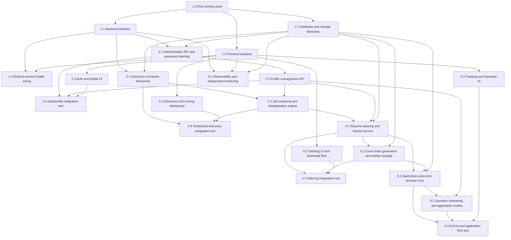

# AutoApply AI - Implementation Plan

**Project**: AutoApply AI | **Version**: 1.0 | **Created**: 2026-06-19
**Author**: ARCHITECT | **Status**: IN PROGRESS

---

## Dependency Graph

---

## Wave Summary

| Wave | Stories | Notes |
|------|---------|-------|
| 1 | 1.0 | Root tooling seed |
| 2 | 1.1, 1.2 | Skeletons (Backend & Frontend) |
| 3 | 1.3, 1.4 | DB bootstrap & health check wiring |
| 4 | 2.1, 2.3 | Identity setup (Auth API & UI mock-wiring) |
| 5 | 2.2, 3.1 | Core details (Profile API & Connector framework) |
| 6 | 2.4, 3.3 | Ingestion setup (Auth integration test & Discovery UI) |
| 7 | 3.2, 4.3 | Scoring & Tailoring UI (Matching engine & Tailor workspace UI) |
| 8 | 3.4, 4.1 | Documents pipeline (Discovery integration test & Gemini service) |
| 9 | 4.2, 5.3 | Outputs & tracking (Letter generation/storage & tracking UI) |
| 10 | 4.4, 5.1 | Operations launch (Tailoring integration test & Headless browser core) |
| 11 | 5.2, 6.1 | Submissions prep (Form modes/QA agent & Observability) |
| 12 | 5.4 | Final integration (E2E submission integration test) |

---

## Overview

**Story Count**: 22
**Build Cycles**: Not used
**UI/UX Design**: Not included in this planning pass
**Team Size Hint**: 2

---

## Epic Breakdown

- Epic 1: Foundation - bootstrap the stack, connect frontend to backend, and verify the walking skeleton.
- Epic 2: Identity & Profile - deliver authentication, profile management, and first user-facing account screens.
- Epic 3: Discovery & Matching - ingest jobs from ATS connectors, deduplicate, score, and expose the discovery dashboard.
- Epic 4: Tailoring - generate tailored resumes and cover letters, then let users review and download them.
- Epic 5: Application Execution & Tracking - execute browser applications, handle recruiter questions, and show tracking/reporting.
- Epic 6: Operations & Hardening - observability, smoke checks, and deployment hardening.

---

## EPIC 1: FOUNDATION

**Owner**: ARCHITECT | **Goal**: Create a walking skeleton that proves the full stack can boot, connect, and serve a health signal.

### Story 1.0: Root tooling seed
**Developer**: Dev 1  
Create the root project scaffolding and shared tooling files needed by the frontend, backend, and deployment layers.
 
### Story 1.1: Backend skeleton
**Developer**: Dev 1  
Create the FastAPI application shell, health endpoint, and app bootstrap wiring.
 
### Story 1.2: Frontend skeleton
**Developer**: Dev 2  
Create the React JS application shell, root layout, and initial dashboard frame.
 
### Story 1.3: Database and storage bootstrap
**Developer**: Dev 1  
Create PostgreSQL session wiring, MinIO adapter scaffolding, and migration entry points.
 
### Story 1.4: Shell-to-service health wiring
**Developer**: Dev 2  
Wire the frontend to read backend health and show connection status in the UI.
 
---
 
## EPIC 2: IDENTITY & PROFILE
 
**Owner**: ARCHITECT | **Goal**: Enable secure user access and candidate profile management.
 
### Story 2.1: Authentication API and password hashing
**Developer**: Dev 1  
Implement registration, login, and Argon2 password hashing.
 
### Story 2.2: Profile management API
**Developer**: Dev 1  
Implement profile CRUD, resume metadata, and preference storage.
 
### Story 2.3: Auth and profile UI
**Developer**: Dev 2  
Implement login and profile screens and wire them to the API contracts.
 
### Story 2.4: Auth/profile integration test
**Developer**: Dev 1  
Verify the end-to-end account and profile flow across backend and frontend.
 
---
 
## EPIC 3: DISCOVERY & MATCHING
 
**Owner**: ARCHITECT | **Goal**: Discover jobs, score them, and present ranked opportunities.
 
### Story 3.1: Discovery connector framework
**Developer**: Dev 2  
Create the ATS connector framework and initial Greenhouse/Lever discovery paths.
 
### Story 3.2: Job matching and deduplication engine
**Developer**: Dev 1  
Implement job scoring, weighting, and duplicate detection logic.
 
### Story 3.3: Discovery and scoring dashboard
**Developer**: Dev 2  
Build the jobs dashboard with match-score presentation and filtering.
 
### Story 3.4: Scheduled discovery integration test
**Developer**: Dev 1  
Verify scheduled discovery, storage, and dashboard data flow.
 
---
 
## EPIC 4: TAILORING
 
**Owner**: ARCHITECT | **Goal**: Generate tailored resumes and cover letters and make them downloadable.
 
### Story 4.1: Resume tailoring and Gemini service
**Developer**: Dev 2  
Implement the tailoring service and Gemini integration.
 
### Story 4.2: Cover letter generation and artifact storage
**Developer**: Dev 1  
Persist tailored cover letters and generated artifacts in MinIO.
 
### Story 4.3: Tailoring UI and download flow
**Developer**: Dev 2  
Build the tailoring experience and download actions in the dashboard.
 
### Story 4.4: Tailoring integration test
**Developer**: Dev 1  
Verify the full tailoring pipeline from input profile to downloadable artifacts.
 
---
 
## EPIC 5: APPLICATION EXECUTION & TRACKING
 
**Owner**: ARCHITECT | **Goal**: Execute applications, answer recruiter questions, and track outcomes.
 
### Story 5.1: Application execution browser core
**Developer**: Dev 2  
Implement the browser automation core for application submission.
 
### Story 5.2: Question answering and application modes
**Developer**: Dev 1  
Implement application modes and recruiter question answering flows.
 
### Story 5.3: Tracking and reporting UI
**Developer**: Dev 2  
Build the application tracking and reporting experience.
 
### Story 5.4: End-to-end application flow test
**Developer**: Dev 1  
Verify discovery-to-submission-to-tracking through one end-to-end flow.
 
---
 
## EPIC 6: OPERATIONS & HARDENING
 
**Owner**: ARCHITECT | **Goal**: Add observability and deployment hardening for a production-ready MVP.
 
### Story 6.1: Observability and deployment hardening
**Developer**: Dev 2  
Implement structured logging, metrics, smoke checks, and deployment hardening.
 
---

## QA Manual Testing Groups

- Foundation smoke: app boots, backend health responds, frontend sees backend connection.
- Identity & Profile: registration, login, profile save, resume upload metadata.
- Discovery & Matching: connector discovery, deduplication, score filtering, dashboard rendering.
- Tailoring: Gemini output generation, artifact storage, download verification.
- Application Execution & Tracking: application submission modes, recruiter answers, tracking entries.
- Operations: logging, metrics, smoke tests, container startup validation.
