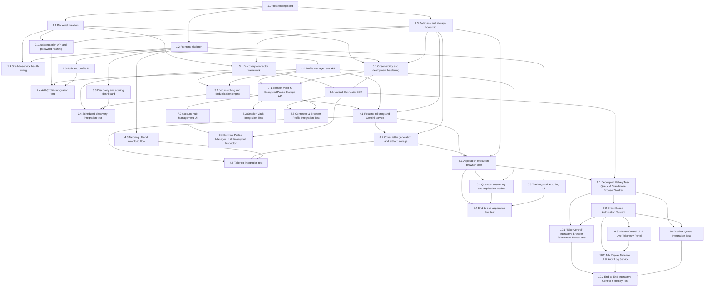

# AutoApply AI - Implementation Plan

**Project**: AutoApply AI | **Version**: 1.0 | **Created**: 2026-06-19
**Author**: ARCHITECT | **Status**: IN PROGRESS

---

## Dependency Graph

```mermaid
graph TD
  S10[1.0 Root tooling seed]
  S11[1.1 Backend skeleton]
  S12[1.2 Frontend skeleton]
  S13[1.3 Database and storage bootstrap]
  S14[1.4 Shell-to-service health wiring]
  S21[2.1 Authentication API and password hashing]
  S22[2.2 Profile management API]
  S23[2.3 Auth and profile UI]
  S24[2.4 Auth/profile integration test]
  S31[3.1 Discovery connector framework]
  S32[3.2 Job matching and deduplication engine]
  S33[3.3 Discovery and scoring dashboard]
  S34[3.4 Scheduled discovery integration test]
  S41[4.1 Resume tailoring and Gemini service]
  S42[4.2 Cover letter generation and artifact storage]
  S43[4.3 Tailoring UI and download flow]
  S44[4.4 Tailoring integration test]
  S51[5.1 Application execution browser core]
  S52[5.2 Question answering and application modes]
  S53[5.3 Tracking and reporting UI]
  S54[5.4 End-to-end application flow test]
  S61[6.1 Observability and deployment hardening]

  S10 --> S11
  S10 --> S12
  S10 --> S13
  S11 --> S14
  S12 --> S14
  S11 --> S21
  S13 --> S21
  S12 --> S23
  S21 --> S22
  S11 --> S31
  S13 --> S31
  S21 --> S24
  S22 --> S24
  S23 --> S24
  S12 --> S33
  S31 --> S32
  S22 --> S32
  S12 --> S43
  S31 --> S34
  S32 --> S34
  S33 --> S34
  S32 --> S41
  S22 --> S41
  S13 --> S41
  S41 --> S42
  S13 --> S42
  S12 --> S53
  S41 --> S44
  S42 --> S44
  S43 --> S44
  S41 --> S51
  S42 --> S51
  S13 --> S51
  S51 --> S52
  S22 --> S52
  S11 --> S61
  S12 --> S61
  S13 --> S61
  S51 --> S54
  S52 --> S54
  S53 --> S54

  S71[7.1 Session Vault & Encrypted Profile Storage API]
  S72[7.2 Account Hub Management UI]
  S73[7.3 Session Vault Integration Test]
  S81[8.1 Unified Connector SDK]
  S82[8.2 Browser Profile Manager UI & Fingerprint Inspector]
  S83[8.3 Connector & Browser Profile Integration Test]
  S91[9.1 Decoupled Valkey Task Queue & Standalone Browser Worker]
  S92[9.2 Event-Based Automation System]
  S93[9.3 Worker Control UI & Live Telemetry Panel]
  S94[9.4 Worker Queue Integration Test]
  S101[10.1 'Take Control' Interactive Browser Takeover & Handshake]
  S102[10.2 Job Replay Timeline UI & Audit Log Service]
  S103[10.3 End-to-End Interactive Control & Replay Test]

  S22 --> S71
  S61 --> S71
  S31 --> S81
  S61 --> S81
  S71 --> S72
  S71 --> S73
  S72 --> S82
  S81 --> S82
  S81 --> S83
  S71 --> S83
  S51 --> S91
  S81 --> S91
  S91 --> S92
  S92 --> S93
  S91 --> S94
  S92 --> S94
  S91 --> S101
  S92 --> S101
  S92 --> S102
  S93 --> S102
  S101 --> S103
  S102 --> S103
  S94 --> S103
```

---

## Wave Summary

| Wave | Stories | Notes |
|------|---------|-------|
| 1 | 1.0 | Root tooling seed |
| 2 | 1.1, 1.2 | Skeletons (Backend & Frontend) |
| 3 | 1.3, 1.4 | DB bootstrap & health check wiring |
| 4 | 2.1, 2.3 | Identity setup (Auth API & UI mock-wiring) |
| 5 | 2.2, 3.1 | Core details (Profile API & Connector framework) |
| 6 | 2.4, 3.3 | Ingestion setup (Auth integration test & Discovery UI) |
| 7 | 3.2, 4.3 | Scoring & Tailoring UI (Matching engine & Tailor workspace UI) |
| 8 | 3.4, 4.1 | Documents pipeline (Discovery integration test & Gemini service) |
| 9 | 4.2, 5.3 | Outputs & tracking (Letter generation/storage & tracking UI) |
| 10 | 4.4, 5.1 | Operations launch (Tailoring integration test & Headless browser core) |
| 11 | 5.2, 6.1 | Submissions prep (Form modes/QA agent & Observability) |
| 12 | 5.4 | Final integration (E2E submission integration test) |
| 13 | 7.1, 8.1 | Session Vault API & Unified Connector SDK |
| 14 | 7.2, 7.3 | Account Hub UI & Vault Integration Test |
| 15 | 8.2, 8.3, 8.4 | Browser Profile UI, Connector SDK Test, and Portal Coverage |
| 16 | 9.1, 9.2 | Standalone Worker & Event System |
| 17 | 9.3, 9.4 | Worker Control UI & Worker Queue Test |
| 18 | 10.1, 10.2 | Interactive Takeover & Job Replay Timeline UI |
| 19 | 10.3 | Interactive Control & Replay E2E Test |

---

## Overview

**Story Count**: 35
**Build Cycles**: Not used
**UI/UX Design**: Not included in this planning pass
**Team Size Hint**: 2

---

## Epic Breakdown

- Epic 1: Foundation - bootstrap the stack, connect frontend to backend, and verify the walking skeleton.
- Epic 2: Identity & Profile - deliver authentication, profile management, and first user-facing account screens.
- Epic 3: Discovery & Matching - ingest jobs from ATS connectors, deduplicate, score, and expose the discovery dashboard.
- Epic 4: Tailoring - generate tailored resumes and cover letters, then let users review and download them.
- Epic 5: Application Execution & Tracking - execute browser applications, handle recruiter questions, and show tracking/reporting.
- Epic 6: Operations & Hardening - observability, smoke checks, and deployment hardening.
- Epic 7: Session Vault & Account Hub - manage multi-portal credentials, browser sessions, cookies, and portal connection health.
- Epic 8: Browser Profile & Connector SDK - unified connector interface for job portals and browser profile management with fingerprint inspection.
- Epic 9: Standalone Worker & Event-Based Automation - decoupled Valkey task queue, standalone browser worker daemon, event emission, and live telemetry control.
- Epic 10: Interactive Control & Job Replay Audit - "Take Control" browser takeover handshake for CAPTCHA/MFA and step-by-step job replay timeline.

---

## EPIC 1: FOUNDATION

**Owner**: ARCHITECT | **Goal**: Create a walking skeleton that proves the full stack can boot, connect, and serve a health signal.

### Story 1.0: Root tooling seed
**Developer**: Dev 1  
Create the root project scaffolding and shared tooling files needed by the frontend, backend, and deployment layers.
 
### Story 1.1: Backend skeleton
**Developer**: Dev 1  
Create the FastAPI application shell, health endpoint, and app bootstrap wiring.
 
### Story 1.2: Frontend skeleton
**Developer**: Dev 2  
Create the React JS application shell, root layout, and initial dashboard frame.
 
### Story 1.3: Database and storage bootstrap
**Developer**: Dev 1  
Create PostgreSQL session wiring, MinIO adapter scaffolding, and migration entry points.
 
### Story 1.4: Shell-to-service health wiring
**Developer**: Dev 2  
Wire the frontend to read backend health and show connection status in the UI.
 
---
 
## EPIC 2: IDENTITY & PROFILE
 
**Owner**: ARCHITECT | **Goal**: Enable secure user access and candidate profile management.
 
### Story 2.1: Authentication API and password hashing
**Developer**: Dev 1  
Implement registration, login, and Argon2 password hashing.
 
### Story 2.2: Profile management API
**Developer**: Dev 1  
Implement profile CRUD, resume metadata, and preference storage.
 
### Story 2.3: Auth and profile UI
**Developer**: Dev 2  
Implement login and profile screens and wire them to the API contracts.
 
### Story 2.4: Auth/profile integration test
**Developer**: Dev 1  
Verify the end-to-end account and profile flow across backend and frontend.
 
---
 
## EPIC 3: DISCOVERY & MATCHING
 
**Owner**: ARCHITECT | **Goal**: Discover jobs, score them, and present ranked opportunities.
 
### Story 3.1: Discovery connector framework
**Developer**: Dev 2  
Create the ATS connector framework and initial Greenhouse/Lever discovery paths.
 
### Story 3.2: Job matching and deduplication engine
**Developer**: Dev 1  
Implement job scoring, weighting, and duplicate detection logic.
 
### Story 3.3: Discovery and scoring dashboard
**Developer**: Dev 2  
Build the jobs dashboard with match-score presentation and filtering.
 
### Story 3.4: Scheduled discovery integration test
**Developer**: Dev 1  
Verify scheduled discovery, storage, and dashboard data flow.
 
---
 
## EPIC 4: TAILORING
 
**Owner**: ARCHITECT | **Goal**: Generate tailored resumes and cover letters and make them downloadable.
 
### Story 4.1: Resume tailoring and Gemini service
**Developer**: Dev 2  
Implement the tailoring service and Gemini integration.
 
### Story 4.2: Cover letter generation and artifact storage
**Developer**: Dev 1  
Persist tailored cover letters and generated artifacts in MinIO.
 
### Story 4.3: Tailoring UI and download flow
**Developer**: Dev 2  
Build the tailoring experience and download actions in the dashboard.
 
### Story 4.4: Tailoring integration test
**Developer**: Dev 1  
Verify the full tailoring pipeline from input profile to downloadable artifacts.
 
---
 
## EPIC 5: APPLICATION EXECUTION & TRACKING
 
**Owner**: ARCHITECT | **Goal**: Execute applications, answer recruiter questions, and track outcomes.
 
### Story 5.1: Application execution browser core
**Developer**: Dev 2  
Implement the browser automation core for application submission.
 
### Story 5.2: Question answering and application modes
**Developer**: Dev 1  
Implement application modes and recruiter question answering flows.
 
### Story 5.3: Tracking and reporting UI
**Developer**: Dev 2  
Build the application tracking and reporting experience.
 
### Story 5.4: End-to-end application flow test
**Developer**: Dev 1  
Verify discovery-to-submission-to-tracking through one end-to-end flow.
 
---
 
## EPIC 6: OPERATIONS & HARDENING
 
**Owner**: ARCHITECT | **Goal**: Add observability and deployment hardening for a production-ready MVP.
 
### Story 6.1: Observability and deployment hardening
**Developer**: Dev 2  
Implement structured logging, metrics, smoke checks, and deployment hardening.
 
---

## EPIC 7: SESSION VAULT & ACCOUNT HUB

**Owner**: ARCHITECT | **Goal**: Store browser sessions, cookies, and local storage encrypted in a Session Vault and present connected portal health in the Account Hub.

### Story 7.1: Session Vault & Encrypted Profile Storage API
**Developer**: Dev 1  
Implement encrypted AES-256-GCM Session Vault storage for browser cookies, session state, and account credentials.

### Story 7.2: Account Hub Management UI
**Developer**: Dev 2  
Build the Account Hub interface displaying portal connection health, session validity, and account connection controls.

### Story 7.3: Session Vault Integration Test
**Developer**: Dev 1  
Verify encryption/decryption, session validation, and database persistence in the Session Vault.

---

## EPIC 8: BROWSER PROFILE & CONNECTOR SDK

**Owner**: ARCHITECT | **Goal**: Standardize job portal interactions with a Unified Connector SDK and expose browser profile fingerprint management.

### Story 8.1: Unified Connector SDK
**Developer**: Dev 2  
Implement the standardized connector contract (`connect`, `disconnect`, `validate_session`, `search_jobs`, `apply`, `health_check`, `refresh_session`).

### Story 8.2: Browser Profile Manager UI & Fingerprint Inspector
**Developer**: Dev 2  
Build the Browser Profile Manager UI for inspecting Chromium browser sessions, cookies, user-agent fingerprints, and manual launch controls.

### Story 8.3: Connector & Browser Profile Integration Test
**Developer**: Dev 1  
Verify the Unified Connector SDK contracts and browser profile session lifecycle in an integration test.

### Story 8.4: LinkedIn, Naukri & Glassdoor Portal Connectors and Safe Auto-Apply Runtime
**Developer**: Dev 1  
Implement real portal connectors for LinkedIn, Naukri, and Glassdoor, restore session-vault browser state, and add safe automation gates, challenge takeover, and application validation needed for user-driven auto-apply workflows.

---

## EPIC 9: STANDALONE BROWSER WORKER & EVENT-BASED AUTOMATION

**Owner**: ARCHITECT | **Goal**: Decouple browser execution into a standalone worker daemon backed by Valkey queues and an event-based automation pipeline.

### Story 9.1: Decoupled Valkey Task Queue & Standalone Browser Worker
**Developer**: Dev 1  
Implement the Valkey-backed task queue and standalone browser worker daemon isolated from the FastAPI application server.

### Story 9.2: Event-Based Automation System
**Developer**: Dev 2  
Implement event emitter and handler architecture (`ApplicationStarted`, `WorkerAssigned`, `SessionValidated`, `ApplicationSubmitted`).

### Story 9.3: Worker Control UI & Live Telemetry Panel
**Developer**: Dev 2  
Build the live worker control UI showing active worker status, step telemetry, pause, resume, and stop controls.

### Story 9.4: Worker Queue Integration Test
**Developer**: Dev 1  
Verify background task queuing, worker execution, and event emission across the decoupled architecture.

---

## EPIC 10: INTERACTIVE CONTROL & JOB REPLAY AUDIT

**Owner**: ARCHITECT | **Goal**: Provide "Take Control" browser takeover for CAPTCHA/MFA challenges and step-by-step job replay audit trails.

### Story 10.1: 'Take Control' Interactive Browser Takeover & Handshake
**Developer**: Dev 1  
Implement the interactive browser takeover protocol allowing candidates to solve CAPTCHA/MFA and hand control back to the worker seamlessly.

### Story 10.2: Job Replay Timeline UI & Audit Log Service
**Developer**: Dev 2  
Build the step-by-step job replay timeline UI and audit trail service detailing every execution event.

### Story 10.3: End-to-End Interactive Control & Replay Test
**Developer**: Dev 1  
Verify end-to-end browser takeover, resume automation handshake, and step-by-step replay logging.

---

## QA Manual Testing Groups

- Foundation smoke: app boots, backend health responds, frontend sees backend connection.
- Identity & Profile: registration, login, profile save, resume upload metadata.
- Discovery & Matching: connector discovery, deduplication, score filtering, dashboard rendering.
- Tailoring: Gemini output generation, artifact storage, download verification.
- Application Execution & Tracking: application submission modes, recruiter answers, tracking entries.
- Operations: logging, metrics, smoke tests, container startup validation.
- Session Vault & Account Hub: portal connection health, encrypted session storage, account connection cards.
- Browser Profile & Connector SDK: browser fingerprint inspection, profile open/reconnect actions, unified connector lifecycle.
- Standalone Worker & Event System: background queue processing, live worker telemetry, pause/stop worker actions.
- Interactive Control & Replay: "Take Control" browser takeover handshake, step-by-step execution timeline replay.
