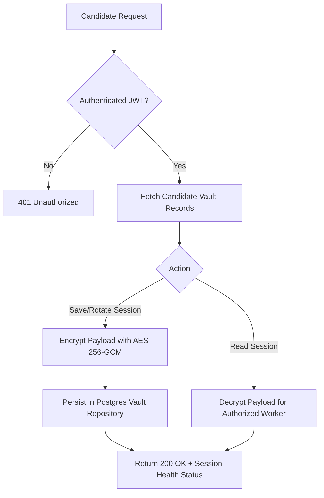

# Story 7.1: Session Vault & Encrypted Profile Storage API

**BUILDID**: NO-CYCLE | **Epic**: 7 - SESSION VAULT & ACCOUNT HUB | **ID**: 7.1 | **Date**: 2026-07-29 | **Jira**: LOCAL  
**Wave**: 13 | **Requires**: [2.2, 6.1] | **Enables**: [7.2, 7.3, 8.3]  
**Files Touched**: `backend/app/domain/vault.py`, `backend/app/infrastructure/db/vault_repository.py`, `backend/app/api/vault.py`  
**Roles Ref**: Candidate  
**QA Candidate**: Yes — Observable: Encrypted session vault CRUD API; Mechanism: AES-256-GCM encrypted database storage; Authz & preconditions: Authenticated Candidate JWT; Edge & idempotency: Re-saving portal credentials updates encrypted payload cleanly; Regression: Existing profile CRUD.

---

## 👤 User Reference

### Description
Provide a secure Session Vault API enabling job seekers to store, retrieve, validate, and rotate portal login cookies, session tokens, local storage snapshots, and encrypted credentials across job boards (LinkedIn, Naukri, Indeed, Greenhouse, Lever, Workday). Rather than relying on plain passwords, the vault focuses on preserving browser sessions to keep job search automation healthy.

### Acceptance Criteria
- Candidate can create, read, update, and delete portal session vault entries.
- All session cookies, tokens, and optional credentials are encrypted at rest using AES-256-GCM.
- API exposes health status indicators for each connected portal session (`Healthy`, `Reconnect Required`, `Verification Needed`).
- Pre-signed/decrypted session payloads are accessible exclusively via authenticated user JWT endpoints.

### User Flow
**Actor**: Candidate — single-actor project where all candidates manage their own Session Vault.

#### User Journey: Session Vault Management
1. **Entry**: Candidate accesses the Vault API or Account Hub section.
2. **Load**: System fetches active portal vault records belonging to the authenticated candidate.
3. **Render**: Displays list of connected portals with health states (`Healthy`, `Reconnect Required`, `Verification Needed`).
4. **Interact**: Candidate submits new portal session cookies or rotates credentials.
5. **Response**: System encrypts the payload via AES-256-GCM, saves the record in PostgreSQL, and returns updated portal health status.
6. **Error Handling**: Invalid session formats or missing parameters return a structured 400 Bad Request error.



---

## 🤖 AI Agent Reference

### Context Files to Read
- `docs/architecture/design/00-system-architecture-greenfield.md`
- `docs/architecture/design/01-patterns-and-standards-greenfield.md`
- `docs/requirements.md`

### RBAC Enforcement
No role-differentiated access — single actor (Candidate).

### System Responses & Error Cases

| Trigger | System Response | Side Effect |
|---------|-----------------|-------------|
| `POST /api/v1/vault` with valid session payload | 200 OK + Session Vault metadata and status | Encrypts payload with AES-256-GCM and inserts/updates record in `session_vault` table |
| `GET /api/v1/vault` | 200 OK + List of portal session statuses | Reads candidate's vault records from database |
| `GET /api/v1/vault/{portal}/decrypt` | 200 OK + Decrypted session cookies & storage | Decrypts AES-256-GCM payload for active worker usage |
| Missing auth token | 401 Unauthorized | Access denied |
| Non-existent portal entry | 404 Not Found | Error payload returned |

### QA-Observable Behaviour
- `GET /api/v1/vault` returns connected portals with `Healthy`, `Reconnect Required`, or `Verification Needed` status badges.
- `GET /api/v1/vault/{portal}/decrypt` returns the exact decrypted session JSON payload matching the input cookies.
- Direct database inspection confirms raw text in the `encrypted_session_payload` column is cipher text and does not contain plain text session keys.

### Prerequisites
- Story 2.2 and Story 6.1 completed.

### Implementation Steps

1. **Define Domain Model (`backend/app/domain/vault.py`)**:
   ```python
   import uuid
   from datetime import datetime
   from app.infrastructure.db.session import Base
   from sqlalchemy import String, DateTime, ForeignKey, Text
   from sqlalchemy.dialects.postgresql import UUID
   from sqlalchemy.orm import Mapped, mapped_column

   class SessionVault(Base):
       __tablename__ = "session_vault"

       id: Mapped[uuid.UUID] = mapped_column(UUID(as_uuid=True), primary_key=True, default=uuid.uuid4)
       user_id: Mapped[uuid.UUID] = mapped_column(UUID(as_uuid=True), ForeignKey("users.id", ondelete="CASCADE"), index=True, nullable=False)
       portal_name: Mapped[str] = mapped_column(String(100), nullable=False)  # e.g., "LinkedIn", "Greenhouse", "Workday"
       status: Mapped[str] = mapped_column(String(50), default="Healthy", nullable=False)  # "Healthy", "Reconnect Required", "Verification Needed"
       encrypted_session_payload: Mapped[str] = mapped_column(Text, nullable=False)  # AES-256-GCM encrypted cookies/localStorage
       last_verified_at: Mapped[datetime] = mapped_column(DateTime, default=datetime.utcnow, nullable=False)
       created_at: Mapped[datetime] = mapped_column(DateTime, default=datetime.utcnow, nullable=False)
       updated_at: Mapped[datetime] = mapped_column(DateTime, default=datetime.utcnow, onupdate=datetime.utcnow, nullable=False)
   ```

2. **Implement Vault Repository (`backend/app/infrastructure/db/vault_repository.py`)**:
   - Create `VaultRepository` handling `save_portal_session`, `get_user_vault`, `get_portal_session`, and `delete_portal_session`.
   - Use `cryptography` AES-256-GCM helper functions to encrypt payloads before SQL writes and decrypt payloads on authorized reads.

3. **Implement Vault Router (`backend/app/api/vault.py`)**:
   - `POST /api/v1/vault`: Encrypts and persists portal cookies and storage.
   - `GET /api/v1/vault`: Lists connected portals and health statuses for candidate.
   - `GET /api/v1/vault/{portal_name}/decrypt`: Returns decrypted session details for worker automation.
   - `DELETE /api/v1/vault/{portal_name}`: Removes portal session.

4. **Register Route**:
   - Register `vault_router` in `backend/app/api/__init__.py`.

### Test Requirements
- **Unit Tests**: Test AES-256-GCM encryption and decryption round-trip helpers in `test_vault.py`.
- **API Tests**: Test `POST`, `GET`, and `DELETE` endpoints with authenticated candidate token.

### Quality Checks
- Zero hardcoded encryption keys (read from `settings.master_encryption_key`).
- Ruff linter check passes cleanly (`ruff check backend/app`).

### Out of Scope
- Direct Playwright browser launching from this API (handled in Epic 8 & 9).

### Completion Evidence
- Pytest suite execution confirming vault endpoints pass with 100% success.
