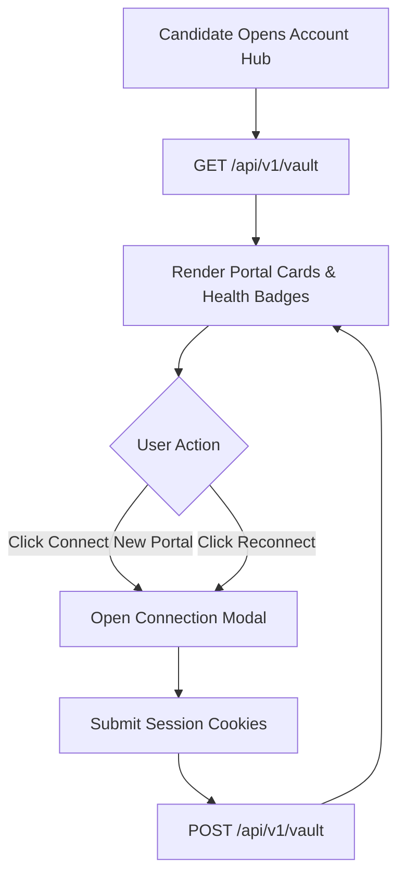

# Story 7.2: Account Hub Management UI

**BUILDID**: NO-CYCLE | **Epic**: 7 - SESSION VAULT & ACCOUNT HUB | **ID**: 7.2 | **Date**: 2026-07-29 | **Jira**: LOCAL  
**Wave**: 14 | **Requires**: [7.1] | **Enables**: [8.2]  
**Files Touched**: `frontend/src/features/vault/AccountHub.tsx`, `frontend/src/App.tsx`, `frontend/src/components/Sidebar.tsx`  
**Roles Ref**: Candidate  
**QA Candidate**: Yes — Observable: Connected portal cards and health status badges; Mechanism: REST API calls to `/api/v1/vault`; Authz & preconditions: Authenticated Candidate JWT; Edge & idempotency: Connecting a new portal updates list dynamically; Regression: Dashboard and Sidebar navigation.

---

## 👤 User Reference

### Description
Build a dedicated **Account Hub** dashboard interface. Instead of a generic settings page, the Account Hub presents job portals (LinkedIn, Naukri, Indeed, Greenhouse, Lever, Workday) as independent connected modules with live health badges (`🟢 Connected`, `🔴 Reconnect Required`, `🟡 Verification Needed`), allowing candidates to connect new portals, rotate session cookies, and manage portal authentication health.

### Acceptance Criteria
- UI displays an Account Hub grid showing portal connection cards with status badges.
- Includes a "Connect New Portal" modal form for pasting session cookies and login credentials.
- Connects directly to `/api/v1/vault` endpoints to fetch and update portal session states.
- Responsive layout with clear error handling for expired or invalid sessions.

### User Flow
**Actor**: Candidate — single-actor project where candidates manage their own portal connections.

#### User Journey: Account Hub Portal Management
1. **Entry**: Candidate clicks "Account Hub" in the sidebar navigation.
2. **Load**: System fetches active portal session records from `/api/v1/vault`.
3. **Render**: Displays grid of portal cards (e.g. LinkedIn, Greenhouse, Lever) with health indicators (`🟢 Connected`, `🔴 Reconnect Required`).
4. **Interact**: Candidate clicks "Connect New Portal" or "Reconnect".
5. **Modal Input**: Pastes session cookies or updates login credentials and clicks "Save Session".
6. **Response**: Account Hub updates the portal card status in real-time.

---

## 🤖 AI Agent Reference

### Context Files to Read
- `docs/architecture/design/00-system-architecture-greenfield.md`
- `docs/architecture/design/01-patterns-and-standards-greenfield.md`

### RBAC Enforcement
No role-differentiated access — single actor (Candidate).

### System Responses & Error Cases

| Trigger | System Response | Side Effect |
|---------|-----------------|-------------|
| Page Load | Fetches portal vault list via `GET /api/v1/vault` | Renders connected portal cards |
| Submit New Portal Session | Posts JSON payload to `POST /api/v1/vault` | Refreshes grid with new portal status |
| API Error | Displays alert banner with user-friendly error message | Preserves modal state for user correction |

### QA-Observable Behaviour
- Account Hub view renders portal cards with correct color-coded health badges (`emerald` for Connected, `rose` for Reconnect Required, `amber` for Verification Needed).
- Submitting a new portal session in the modal adds/updates the card without full page refresh.

### Prerequisites
- Story 7.1 completed.

### Implementation Steps

1. **Create AccountHub Component (`frontend/src/features/vault/AccountHub.tsx`)**:
   - Build portal card grid displaying LinkedIn, Greenhouse, Lever, Workday, Naukri, Indeed.
   - Implement modal for pasting cookies and session details.
   - Use `lucide-react` icons and TailwindCSS dark slate theme.

2. **Integrate into Main Navigation (`frontend/src/App.tsx` & `Sidebar.tsx`)**:
   - Add "Account Hub" navigation item to `Sidebar.tsx`.
   - Add `case 'vault': return <AccountHub token={token} />;` inside `App.tsx`.

### Test Requirements
- **Frontend Build & Lint**: Run `npm run build` (tsc & Vite) and `npm run lint` (ESLint) ensuring 0 warnings.

### Quality Checks
- Zero plain text secret leaks in UI component state or console logs.

### Out of Scope
- Direct Playwright browser profile inspector (handled in Story 8.2).

### Completion Evidence
- Clean Vite build output and ESLint passing report.
